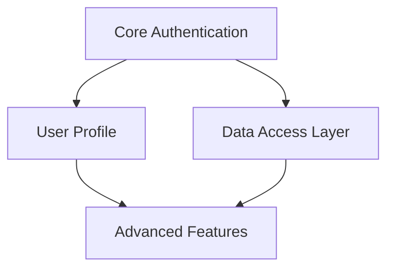
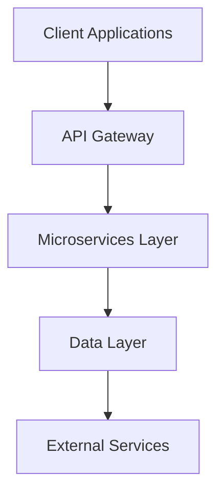

# Issue: [Project Title]

## Original Request
> **Date Created**: [YYYY-MM-DD]  
> **Orchestrator**: [Orchestrator execution ID/reference]  
> **Status**: 🔄 In Progress | ✅ Completed | ⏸️ Paused | ❌ Cancelled

[Full original request from stakeholder/user]

---

## Research Phase (by researcher agent)
> **Status**: 🔄 In Progress | ✅ Completed | ❌ Failed  
> **Agent**: researcher  
> **Started**: [timestamp]  
> **Completed**: [timestamp]

### Market Research Findings
[Market analysis, competitive landscape, user needs analysis]

### Technology Landscape Analysis
[Technology trends, available solutions, technical constraints]

### Implementation Feasibility Assessment
[Technical feasibility, complexity assessment, resource requirements]

### Key Recommendations for Requirements Phase
- **High-Priority Features**: [List based on market research]
- **Technical Constraints**: [Limitations that should shape requirements]
- **User Personas**: [Key user types and their needs]
- **Competitive Differentiation**: [Unique value propositions identified]

### Research Deliverables
- [ ] Market research report
- [ ] Competitive analysis
- [ ] Technology evaluation matrix
- [ ] User persona definitions
- [ ] Technical feasibility assessment

---

## Requirements Analysis Phase (by fn-reqs agent)
> **Status**: 🔄 In Progress | ✅ Completed | ❌ Failed  
> **Agent**: fn-reqs  
> **Started**: [timestamp]  
> **Completed**: [timestamp]

### Functional Requirements

#### FR-001: [Feature Name]
- **Description**: [Clear description of functionality]
- **Priority**: High/Medium/Low
- **Complexity**: Simple/Medium/Complex
- **Dependencies**: [List of dependent requirements]
- **Acceptance Criteria**:
  - [ ] Specific, testable criteria
  - [ ] Edge case handling
  - [ ] Error scenarios

[Additional FR-XXX entries as needed]

### Non-Functional Requirements
- **Performance**: [Response time, throughput requirements]
- **Security**: [Authentication, authorization, data protection]
- **Scalability**: [Expected load, growth patterns]
- **Compliance**: [Regulatory requirements]

### Feature Priority Matrix
| Feature | Business Value | Technical Complexity | Priority | Implementation Phase |
|---------|----------------|---------------------|----------|---------------------|
| Feature A | High | Low | P0 | Phase 1 |
| Feature B | Medium | High | P1 | Phase 2 |

### Dependency Mapping

### Stakeholder Questions & Resolutions
1. **Question**: [Clarifying question asked]
   - **Answer**: [Stakeholder response]
   - **Impact**: [How this affects requirements]

### Requirements Deliverables
- [ ] Structured functional requirements document
- [ ] Feature priority matrix
- [ ] Dependency mapping
- [ ] Non-functional requirements constraints
- [ ] Acceptance criteria definitions

---

## Architecture Design Phase (by architect agent)
> **Status**: 🔄 In Progress | ✅ Completed | ❌ Failed  
> **Agent**: architect  
> **Started**: [timestamp]  
> **Completed**: [timestamp]

### System Architecture Overview
[High-level system description and design decisions]

### Architecture Diagrams

### Technology Stack Recommendations

#### Backend
- **Language**: [Chosen language with rationale]
- **Framework**: [Framework selection and reasoning]
- **Database**: [Database technology and justification]
- **Key Libraries**: [Essential dependencies with versions]

#### Frontend
- **Framework**: [UI framework selection]
- **State Management**: [State management approach]
- **UI Library**: [Component library choice]
- **Build Tools**: [Development and build tooling]

#### Infrastructure
- **Cloud Provider**: [Provider selection and services]
- **Containerization**: [Docker/Kubernetes strategy]
- **CI/CD**: [Deployment pipeline approach]
- **Monitoring**: [Observability and logging setup]

### Component Specifications

#### [Component Name]
- **Purpose**: [What this component does]
- **Responsibilities**: [Key functions and boundaries]
- **Technology**: [Specific tech stack for this component]
- **Scaling Strategy**: [How this component scales]
- **Dependencies**: [Other components and external services]

### Data Architecture

#### Database Design
- **Schema**: [Key entities and relationships]
- **Data Flow**: [How data moves through the system]
- **Backup & Recovery**: [Data protection strategy]
- **Performance Optimization**: [Indexing and optimization strategy]

### API Architecture
- **Design Pattern**: [REST/GraphQL/gRPC selection]
- **Authentication**: [Auth strategy and implementation]
- **Rate Limiting**: [API protection mechanisms]
- **Documentation**: [OpenAPI/Swagger specifications]

### Security Architecture
- **Authentication Flow**: [Login and session management]
- **Authorization Model**: [Role-based access control]
- **Data Protection**: [Encryption at rest and in transit]
- **Compliance**: [Regulatory requirements adherence]

### Implementation Roadmap

#### Phase 1: Core Infrastructure (Weeks 1-4)
- [ ] Database setup and core schema
- [ ] Authentication service
- [ ] Basic API framework
- [ ] Development environment setup

#### Phase 2: Core Features (Weeks 5-8)
- [ ] Primary business logic implementation
- [ ] API endpoints for core features
- [ ] Frontend integration points
- [ ] Basic testing framework

#### Phase 3: Advanced Features (Weeks 9-12)
- [ ] Secondary feature implementation
- [ ] Performance optimizations
- [ ] Advanced integrations
- [ ] Comprehensive monitoring

### Risk Assessment & Mitigation

#### Technical Risks
| Risk | Impact | Probability | Mitigation Strategy |
|------|--------|-------------|-------------------|
| Scalability bottlenecks | High | Medium | Load testing, caching strategy |
| Integration failures | Medium | Low | Circuit breakers, fallback mechanisms |

#### Operational Risks
| Risk | Impact | Probability | Mitigation Strategy |
|------|--------|-------------|-------------------|
| Deployment issues | Medium | Medium | Blue-green deployment, rollback strategy |
| Data loss | High | Low | Regular backups, disaster recovery plan |

### Architecture Deliverables
- [ ] System architecture diagrams
- [ ] Component specifications
- [ ] API documentation
- [ ] Database schema design
- [ ] Deployment architecture
- [ ] Technology stack recommendations
- [ ] Implementation roadmap

---

## Project Summary & Next Steps

### Overall Project Status
- **Research**: [Status summary]
- **Requirements**: [Status summary]  
- **Architecture**: [Status summary]

### Key Decisions Made
1. **Decision 1**: [What was decided and why]
2. **Decision 2**: [What was decided and why]
3. **Decision 3**: [What was decided and why]

### Critical Success Factors
- [Factor 1 that must be achieved]
- [Factor 2 that must be achieved]
- [Factor 3 that must be achieved]

### Recommended Next Actions
1. **Immediate (Next 1-2 weeks)**:
   - [ ] Action item 1
   - [ ] Action item 2

2. **Short-term (Next month)**:
   - [ ] Action item 3
   - [ ] Action item 4

3. **Long-term (Next quarter)**:
   - [ ] Action item 5
   - [ ] Action item 6

### Stakeholder Sign-off
- [ ] **Research findings approved** by [Stakeholder]
- [ ] **Requirements validated** by [Stakeholder]
- [ ] **Architecture approved** by [Technical Lead]
- [ ] **Implementation plan accepted** by [Project Manager]

---

## Appendices

### A. Research Data
[Detailed research findings, surveys, competitive analysis data]

### B. Requirements Traceability Matrix
[Mapping of requirements to research findings and architecture decisions]

### C. Architecture Decision Records (ADRs)
[Detailed rationale for major architectural decisions]

### D. References
- [Research sources, documentation links, industry reports]
- [Technical documentation and specifications]
- [Stakeholder meeting notes and decisions]