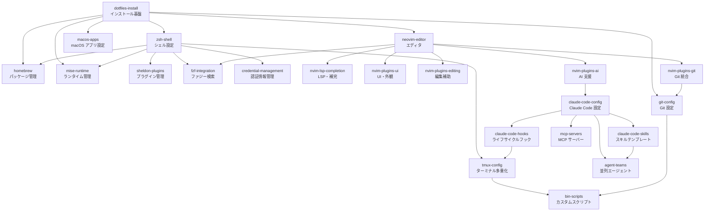

# Dotfiles リポジトリ包括ドキュメント

Generated: 2026-04-06
Sources: 27 llmwiki entities

## Overview

このドキュメントは、dotfiles リポジトリ全体の構成を包括的に説明するものです。リポジトリは macOS・Ubuntu・WSL・Vagrant に対応したクロスプラットフォームの開発環境設定を管理しており、以下の4領域で構成されています。

- Claude Code 設定（AI エージェント CLI の動作・権限・ワークフロー）
- Neovim エディタ（lazy.nvim 管理の約50プラグイン構成）
- シェル環境（zsh の同期・非同期二段階ロード体制）
- dotfiles インストール（冪等な自動セットアップ基盤）

すべての設定ファイルはシンボリックリンクで各所へ配置され、`install/update.sh` 1コマンドで全体をセットアップできる設計になっています。

## Components

### Claude Code 設定

#### claude-code-config

Claude Code CLI の包括的な設定群です。`claude/CLAUDE.md` にエージェント行動規範（証拠優先・日本語出力・ファイル削除禁止・絵文字禁止など）を定義しています。`settings.json` では環境変数（`CLAUDE_CODE_DISABLE_AUTO_MEMORY=1`、`EXPERIMENTAL_AGENT_TEAMS=1`）、200以上の bash コマンド許可パターン、deny リスト（rm -rf・chmod 777 など）を設定します。

ステータスラインはモデル名・コンテキスト使用量・コスト・レート制限を3行表示します。タイムゾーンは Asia/Tokyo 固定です。プラグインとして clangd-lsp・gopls-lsp・lua-lsp・typescript-lsp・slack・llmwiki（ktrysmt）が有効化されています。

関連設定ファイル: `claude/CLAUDE.md`、`claude/settings.json`、`claude/keybindings.json`、`claude/rules/markdown.md`、`claude/rules/pdf-mcp.md`、`claude/statusline-command.sh`

#### claude-code-hooks

Claude Code のライフサイクルイベント（SessionStart・SessionEnd・PostToolUse・UserPromptSubmit・Notification・Stop）に応じてスクリプトを実行するフック機構です。主なフックは以下の通りです。

- `cleanup-short-sessions.sh`（SessionEnd）: ユーザーメッセージが2件未満のセッションのトランスクリプトを削除
- `session_summarizer.py`（SessionEnd）: `claude -p` サブプロセスで AI 要約を生成し `~/.claude/session-summaries/` に保存
- `markdown-lint.sh`（PostToolUse）: 太字・横向き Mermaid・複数行ノード定義の違反を検出し、ファイル書き込みをブロック
- `sandbox-auto-allow.sh`（PostToolUse Bash）: ネットワークエラーからブロックドメインを抽出し `settings.json` の `allowedDomains` へ自動追記
- `tmux-window-claude-status.sh`: セッション状態に応じて tmux ウィンドウのタイトルと色を更新

#### claude-code-skills

Claude Code 用のカスタムスキルテンプレートです。ブラウザ自動化系と Agent Teams ワークフロー系の2カテゴリで構成されます。

ブラウザ自動化:
- `agent-browser`: セッションごとに新規ブラウザを起動するスタンドアロン型
- `agent-browser-9222`: ポート 9222 の既存 Chrome に CDP 接続してログインセッションを保持する型

Agent Teams ワークフロー（TeamCreate を使用した並列エージェント）:
- `teammate-fullstack-feature`: フェーズ A（型定義）→ B（バックエンド＋フロントエンド並列）→ C（テスト）
- `teammate-parallel-review`: セキュリティ・パフォーマンス・カバレッジの3視点で並列レビュー
- `teammate-parallel-research`: MCP（Arxiv・WebSearch）を使った多軸リサーチ
- `teammate-parallel-refactor`: ディレクトリ単位の分割リファクタリング
- `teammate-hypothesis-debug`: 競合仮説を Read-Only で並列調査し確定・否定・不確定を判定

#### mcp-servers

`.mcp.json` で管理する MCP サーバーレジストリです。HTTP ベースとコマンドベースの2種類があります。

HTTP ベース: aws-docs（AWS ドキュメント）、grep-github（100万以上のパブリックリポジトリ検索）

コマンドベース: arxiv（学術論文検索）、playwright（ブラウザ自動化）、pdf-mcp（SQLite キャッシュ付き PDF テキスト抽出）、pdf-docling（OCR・表抽出・Markdown エクスポート）、gemini-cli（Google Gemini API）、mcp-think-as（推論強化）、serena・o3-search・context7（追加検索・コンテキスト）

#### agent-teams

Claude Code の `TeamCreate` API を使った並列実行パターンです。Lead エージェントが複数の Teammate を調整します。Teammate は Read-Only（調査・レビュー）と Read-Write（実装・リファクタリング）の2モードがあります。ファイル排他所有権で競合を防ぎ、フェーズ実行で依存関係を管理します。`EXPERIMENTAL_AGENT_TEAMS=1` 環境変数で有効化されます。

#### devcontainer

Claude Code 用の Docker ベース分離開発環境です。マルチアーキテクチャ（amd64・arm64）イメージを GitHub Actions でビルドして GHCR へ公開します。

機能: eBPF ベースの TCP ネットワークトレース（`trace-network.sh`）、iptables ベースのホワイトリストファイアウォール（`init-firewall.sh`・`refresh-firewall.sh`）、Claude Code と MCP サーバーのセットアップ（`setup-claude.sh`）。

`~/.claude-devcontainer` へのバインドマウントで設定を永続化します。`.devcontainer/*/` や `claude/*` の変更で GitHub Actions が自動ビルドします。

### Neovim エディタ

#### neovim-editor

lazy.nvim をプラグインマネージャとして使用する Neovim 設定です。`~/.config/nvim` へシンボリックリンクされています。エントリポイントは `init.lua` で、options・keys・lazynvim・highlight を順にロードします。

主な設定値: リーダーキー Space、エンコーディング UTF-8、インデント2スペース、相対行番号、検索は magic/ignorecase/smartcase、diff アルゴリズム histogram、CJK括弧の matchpairs 対応。

`local.nvim` プラグイン（`nvim/local.nvim/`）がマシン固有設定を担当し、WSL では `win32yank.exe`、Linux では `xsel`、macOS ではデフォルトのクリップボード連携を提供します。アンドゥ履歴は `~/.cache/nvim/undofile` に永続保存されます。有効プラグイン約50個、`_bk` サフィックスで無効化されたプラグイン12個があります。

プラグインファイル命名規則: `ft.*`（ファイルタイプ）、`appearance.*`（UI）、`move.*`（モーション）、`llm.*`（AI）

#### nvim-lsp-completion

LSP・Tree-sitter・自動補完の統合設定です。

LSP: nvim-lspconfig が mason-lspconfig 経由で13サーバー（bashls・clangd・cssls・dockerls・gopls・lua_ls・pylsp・rust_analyzer・svelte・typos_lsp・vimls・yamlls・jsonls）を管理。typescript-tools が styled-components 対応の TypeScript LSP を提供します。

Tree-sitter: Go・Rust・Python・TypeScript・Lua を含む20以上の言語でインクリメンタル解析。textobjects（選択）・textsubjects（スマート選択）・matchup（括弧タグ照合）が有効。

補完エンジン nvim-cmp: cmp-nvim-lsp・vsnip・cmp-buffer・cmp-path・cmp-calc・cmp-nvim-lsp-signature-help がソースとして設定されています。

#### nvim-plugins-ui

Neovim の視覚的・UI 拡張プラグイン群です。

- lualine: gruvbox-material テーマ、ブランチ・差分・診断・ファイルパス・検索カウントを表示
- neo-tree: git ステータス統合のファイルツリー、Ctrl+E でトグル
- yazi.nvim: ターミナルファイルマネージャのフローティングウィンドウ統合（`<leader>e` / `<leader>cw`）
- outline: treesitter/LSP/ctags で構造サイドバー（autofold 深度5）
- hlchunk: コードチャンクのハイライト（#555555）
- nvim-scrollbar: 検索ハイライト付きビジュアルスクロールバー
- guess-indent: ファイルのインデントスタイル自動検出
- pinecone: カスタムカラースキーム（優先度1000）

#### nvim-plugins-editing

フォーマット・lint・コメント・スマートブラケット・アライメントなど編集補助プラグイン群です。

- format-on-save: JS/TS に prettier、JS に eslint_d_fix、その他は LSP フォーマット
- nvim-lint: `node_modules/.bin/eslint` が存在する場合 eslint を BufWritePre 時に実行
- comment: gcc（ノーマル）・gb（ビジュアル）でコメントトグル
- lexima: スマートブラケット挿入と `LeximaAlterCommand`（rg→Rg、lz→Lazy、dv→DiffviewOpen）
- dial: Ctrl+A/X で数値・日付・ブール値・演算子のインクリメント
- mini-align: テキストアライメントのライブプレビュー
- mini-splitjoin: gS でインテリジェントな行結合・分割
- undotree: `<leader>un` でビジュアルアンドゥツリー
- yanky: SQLite 500件ヤンクリング（Ctrl+N/P でサイクル）
- vim-illuminate: カーソル下の単語をハイライト

#### nvim-plugins-git

vim-fugitive・gitsigns・git-conflict・diffview・tig-explorer・octo の Git 統合プラグイン群です。

- vim-fugitive: `:Git` コマンドで git 操作
- gitsigns: サインカラムに差分表示（gw/gb でハンクナビ、g+/g- でステージ/アンステージ）
- git-conflict: マージコンフリクト解消（cww で両側選択）
- diffview: DiffviewOpen・DiffviewFileHistory でビジュアル差分
- tig-explorer: ターミナル git ログブラウザ統合
- octo: Neovim 内で GitHub PR レビュー・Issue 管理

#### nvim-plugins-motion

高速ナビゲーションとスマートテキスト選択のモーション・テキストオブジェクトプラグイン群です。

- vim-easymotion: `;` リーダーでラベルジャンプ
- camel-case-motion: w/b/e/ge が camelCase 対応
- vim-edgemotion: gj/gk で行境界ジャンプ
- treesitter-unit: io/ao で構文認識テキストオブジェクト
- vim-expand-region: v（拡大）/V（縮小）でインクリメンタル選択
- vim-asterisk: */# でカーソル位置保持検索
- vim-abolish: crs（snake_case）・crc（camelCase）・crk（kebab）・cru（UPPER）・crm（Mixed）
- バンドル: leap（f/F ジャンプ）、treehopper（m でノードホップ）、vim-sandwich（surround操作）

#### nvim-plugins-ft

Ansible・CSV/TSV・Astro・Svelte・Terraform・quickfix の拡張ファイルタイプサポートです。nvim-ansible は `*.yaml.j2` / `*.yml.j2` を自動検出します。vim-svelte は vim-javascript と html5.vim に依存します。無効化（`_bk`）: nvim-bqf・vim-goaddtags。

#### nvim-plugins-ai

Neovim の AI コード支援プラグインです。

- claudecode.nvim: ポート10000〜65535で自動起動、右スプリット（幅33%）のターミナル表示。`<leader>cc`（トグル）・`<leader>ca`（追加/送信）・`<leader>cf`（フォーカス）・`<leader>cda`（差分承認）
- copilot: 自動トリガー（テキスト/Markdown を除く全ファイルタイプ）、S-Tab で承認
- 無効化: Avante・Gemini・Sourcegraph Cody

### シェル環境 (zsh)

#### zsh-shell

zsh の設定を同期（blocking）と非同期（deferred）の2フェーズに分割した最適化構成です。

起動フロー:
1. `.zshenv`（`~/.zshenv` へシンボリックリンク）: 最初期ロード。Homebrew PATH（Apple Silicon / Intel 検出）、mise シム、TMUX ソケットディレクトリを設定
2. `.zshrc`（`~/.zshrc` へシンボリックリンク）: sheldon プラグインキャッシュのブートストラップのみ
3. `zsh/sync.zsh`（sheldon 経由・同期）: history（100K件、拡張タイムスタンプ、マルチセッション共有）、completions、setopt、PROMPT、BAT_THEME・FZF_* エクスポート
4. `zsh/async.zsh`（sheldon 経由・非同期）: 全関数・エイリアス・遅延補完

Git エイリアス: gd・gp・gl・gs・gca・gc・gdd・gds・gdt・gdw・glogg・grebase
Kubernetes エイリアス: k・kg・kgp・kd・krm・klo・kex・kns・kctx
カスタム関数: `powered_cd`（ディレクトリ履歴ナビ）・`gwa`/`gwflush`（worktree 管理）・`trans`（Gemini 翻訳）・`dc`（devcontainer 起動）
グローバルエイリアス: G（grep）・L（less）・H（head）・T（tail）・S（sort）・W（wc）

プラットフォーム固有: `gcm.zsh`（WSL2 Git Credential Manager）・`osx.zsh`（macOS Keychain）・`btw.zsh_bk`（無効化: Bitwarden CLI）

#### sheldon-plugins

zsh プラグインマネージャ `sheldon` の設定です（`~/.config/sheldon/plugins.toml` へシンボリックリンク）。`zsh-defer` によるテンプレート化で非同期ロードを実現します。

外部プラグイン: zsh-defer・zsh-syntax-highlighting・zsh-completions・ohmyzsh lib（async・completions・key-bindings・directories）・zsh-better-npm-completion・aws_zsh_completer
ローカルプラグイン: `zsh/async.zsh`（deferred）・`zsh/sync.zsh`（blocking）

ロード順: sync プラグインを先行ブロッキングロードし、以降を defer テンプレートで非同期化します。

#### fzf-integration

シェルと Neovim 双方で統合されたファジー検索基盤です。

シェル: `FZF_DEFAULT_COMMAND` は `fd --type f --hidden --follow`、`FZF_DEFAULT_OPTS` は bat プレビュー・高さ40%・逆レイアウト。Ctrl+T でファイルプレビュー、Ctrl+V で `~/.snippet` からスニペット挿入。`powered_cd` 関数がディレクトリ履歴の fzf ナビゲーションを提供。

Neovim: `fzf-vim`（junegunn/fzf）が Files・GFiles・Buffers・Commands・Ripgrep・History・Windows コマンドを提供。ctrl 修飾で split/vsplit/tabnew のカスタムアクション。

Peco: `.config/peco/config.json` で Ctrl+J/K 選択・シアンスタイルの軽量代替フィルタ。

#### tmux-config

macOS・Ubuntu・WSL・Vagrant に対応したプラットフォーム固有 tmux 設定です。

主な設定: プレフィックスキー Ctrl+S、vi コピーモード、履歴上限1000万行、`bin/tmux-pane-border` スクリプトによる git ブランチ+ディレクトリ表示のペインボーダー、タイムスタンプのステータスライン。

`.zshenv` でソケットディレクトリを設定（devcontainer との互換性確保）。`zshrc` の `auto-rename` 関数が現在ディレクトリ名でウィンドウを自動リネームします。`claude-code-hooks` の `tmux-window-claude-status.sh` が Claude セッション中のウィンドウ状態を更新します。

#### git-config

macOS・Ubuntu・WSL のプラットフォーム別 gitconfig です（`install/symlink.sh` がプラットフォーム検出して配置）。

共通設定: SSH 署名（id_ed25519.pub）・delta 差分ビューア（Dracula テーマ・横並び・行番号）・ghq でのリポジトリ管理（`~/go/src`・`~/project/src`）・git-secrets（AWS パターン）。
グローバル gitignore: `.claude/`・`__pycache__/`・`node_modules/`・`.DS_Store`・`*.swp` など。
設定: diff3 コンフリクトスタイル、デフォルト rebase pull。

#### credential-management

プラットフォーム別3層認証情報管理システムです。

- WSL2: Git Credential Manager（gcm-get/set/rm/ls、確認プロンプト付き）
- macOS: security フレームワーク経由 Keychain（kc-get/set/rm/ls）
- Bitwarden CLI（無効化）: bw-unlock・bw-ls・bw-get・bwe（自動アンロック）

管理対象キー: `ANTHROPIC_API_KEY`・`GEMINI_API_KEY`（`.keys.example` で定義）。`.keys` ファイルに gitignore で保護保存し、環境変数としてエクスポートして Claude Code・Gemini CLI 等から利用されます。

### dotfiles インストール

#### dotfiles-install

`install/update.sh` が全インストール手順をオーケストレーションする冪等なセットアップシステムです。

実行チェーン: `symlink.sh` → `brew.sh` → `mise.sh` → OS 固有スクリプト → `post-install.sh` → sheldon キャッシュ再構築

各スクリプトの役割:
- `lib.sh`: OS 検出（Darwin=mac・microsoft=wsl・vagrant_box_build_time=vagrant・その他=ubuntu）と共通ヘルパー（link_file・ensure_dir・log_*）
- `symlink.sh`: シンボリックリンクの唯一の真実源（シェル・nvim・claude・mise・ツール）
- `brew.sh`: プラットフォーム別 Homebrew bundle インストール
- `mise.sh`: mise アクティベート、fzf キーバインド設定、uv/Python グローバルインストール
- `post-install.sh`: rustup・go install delve・git-secrets・pynvim via uv
- `mac/default.sh`: macOS defaults write コマンド群
- `ubuntu/wsl.sh`: win32yank・wslu・sandbox-runtime の WSL 固有セットアップ

#### homebrew

macOS および Linux のシステム依存関係を管理するパッケージマネージャです。

Brewfile 種別:
- `Brewfile.common`: tig・csvlens・tree・watch・universal-ctags・hyperfine・dufs・git-secrets 等（クロスプラットフォーム）
- `Brewfile.mac`: karabiner-elements・rectangle・raycast・wezterm・linearmouse・alt-tab・clibor・macgesture・wordservice・iterm2（macOS 専用 casks）
- `Brewfile.ubuntu`: Linux 専用フォーミュラ

PATH 設定: `.zshenv` で Apple Silicon（`/opt/homebrew/bin`）と Intel（`/usr/local/bin`）を自動検出。

#### mise-runtime

言語ランタイム・CLI ツール・開発ユーティリティを管理するバージョンマネージャです（asdf の後継）。

グローバル設定: `mise/config.toml`（`~/.config/mise/config.toml` へシンボリックリンク）
プラットフォームオーバーレイ: `mac.toml`（kubectl・kind・helm・eksctl・ruby）・`wsl.toml`（ruby）

管理言語: Go・Node.js・Python 3.13（uv 経由）・Ruby 3.3
CLI ツール: fzf・ripgrep・bat・eza・delta・jq・gh・ghq・peco・yazi・bun・buf・ruff・sheldon
Aqua バックエンド: difftastic・yazi・sheldon

シム起動: `.zshenv` で `eval "$(mise activate zsh --shims)"` を実行。`install/mise.sh` が fzf キーバインドのセットアップも行います。

### 環境別設定

#### devcontainer

Claude Code 用の Docker ベース分離開発環境です。マルチアーキテクチャ（amd64・arm64）イメージを GitHub Actions でビルドして GHCR へ公開します。

機能: eBPF ベースの TCP ネットワークトレース（`trace-network.sh`）、iptables ベースのホワイトリストファイアウォール（`init-firewall.sh`・`refresh-firewall.sh`）、Claude Code と MCP サーバーのセットアップ（`setup-claude.sh`）。

`~/.claude-devcontainer` へのバインドマウントで設定を永続化します。`.devcontainer/*/` や `claude/*` の変更で GitHub Actions が自動ビルドします。

#### macos-apps

macOS 固有アプリケーションの設定群です。

- Karabiner-Elements: かな→Enter・英数→Backspace・Apple キーボード cmd/opt スワップ・Naginata IME ルール
- Rectangle: ウィンドウタイリング（カスタムギャップサイズ・autoProp）
- iTerm2: plist 設定・カスタムキーマップ・Google IME キーマップ
- LinearMouse: マウス加速度無効化
- Raycast: カスタムスクリプト（browser-debug.sh・trans.sh）
- WezTerm: GPU アクセラレーションターミナル（Lua 設定）
- MacGesture: トラックパッドジェスチャー認識

#### windows-apps

Windows 固有アプリケーションの設定群です。

- Windows Terminal: 30以上のカスタムキーバインド、PowerShell/Pwsh デフォルトプロファイル
- Keyhac（Python 製キーリマッパー）: Ctrl+HJKL でバイ風ナビ、アプリ別オーバーライド（Windows Terminal・Brave・MPC-HC）
- WezTerm: GPU アクセラレーションターミナル（Windows 版 Lua 設定）
- XMBC: マウスボタンカスタマイズ

#### chrome-extensions

Chrome/Chromium ブラウザ拡張設定群です。

- Vimium: キーボード駆動ナビゲーション（Gmail・Outlook・Twitter・Drive・Notion・Slack 等を除外リスト登録）。カスタムマップ: gr/gl/go（タブ閉じ）・gf（リンクヒント）・gp（ピン）
- uBlock Origin: 広告ブロック・サイトフィルタ
- Stylus: カスタム CSS 注入
- uBlacklist: 検索結果フィルタ
- SiteBlock: サイトアクセス制限

#### bin-scripts

`bin/` のカスタムユーティリティスクリプト群です。

Git ヘルパー: `git-checkout-remote-branch`（fzy によるインタラクティブブランチ選択・-f 強制・--sync プルーン）・`git-echo-branch-tmux-current-pane`・`git-echo-prompt-is-clean`・`git-echo-username-and-email`

Tmux ヘルパー: `tmux-pane-border`（git ブランチ+ディレクトリフォーマット）・`tsk`（tmux send-keys ラッパー）

Kubernetes ヘルパー: `echo-k8s-info`・`echo-kubectx`・`echo-kubens`（プロンプト/ステータスライン用の静音コンテキスト表示）

その他: `serve-until-close`（単純 HTTP サーバー）・`sh-echo-current-wifi-network`・`claude-review-loop.sh`（Claude Code 反復レビューラッパー）

## Relationships

エンティティ間の主要な依存関係と統合を以下の図に示します。

各領域間の横断的な依存関係は以下の通りです。

シェル→Claude Code: `zsh/osx.zsh` の `kc-get` で取得した `ANTHROPIC_API_KEY` が Claude Code に渡されます。Claude Code フックの `tmux-window-claude-status.sh` が tmux と連携してセッション状態を可視化します。

シェル→Neovim: fzf の環境変数（`FZF_DEFAULT_COMMAND`・`FZF_DEFAULT_OPTS`）は `zsh/sync.zsh` で設定され、Neovim の `fzf-vim` も同じバイナリを参照します。

Neovim→Claude Code: `claudecode.nvim` が Claude Code サービスに接続し、Neovim 内でチャットとコード差分の承認を提供します。

インストール→全体: `install/symlink.sh` が全設定ファイルのシンボリックリンクを管理し、`install/update.sh` が全セットアップをオーケストレーションします。1コマンドで環境全体を再構築できます。

tmux 中心のワークフロー: tmux は単なるターミナル多重化ツールを超えて、zsh（自動リネーム）・Claude Code フック（ウィンドウ状態表示）・bin-scripts（tmux-pane-border・tsk）の統合ハブとして機能します。

## References

使用した llmwiki エンティティ一覧（27件）:

services:
- `.llmwiki/entities/services/claude-code-config.md`
- `.llmwiki/entities/services/homebrew.md`
- `.llmwiki/entities/services/mcp-servers.md`
- `.llmwiki/entities/services/mise-runtime.md`

environments:
- `.llmwiki/entities/environments/devcontainer.md`
- `.llmwiki/entities/environments/macos-apps.md`
- `.llmwiki/entities/environments/windows-apps.md`

components:
- `.llmwiki/entities/components/bin-scripts.md`
- `.llmwiki/entities/components/chrome-extensions.md`
- `.llmwiki/entities/components/claude-code-hooks.md`
- `.llmwiki/entities/components/fzf-integration.md`
- `.llmwiki/entities/components/git-config.md`
- `.llmwiki/entities/components/neovim-editor.md`
- `.llmwiki/entities/components/nvim-lsp-completion.md`
- `.llmwiki/entities/components/nvim-plugins-ai.md`
- `.llmwiki/entities/components/nvim-plugins-editing.md`
- `.llmwiki/entities/components/nvim-plugins-ft.md`
- `.llmwiki/entities/components/nvim-plugins-git.md`
- `.llmwiki/entities/components/nvim-plugins-motion.md`
- `.llmwiki/entities/components/nvim-plugins-ui.md`
- `.llmwiki/entities/components/sheldon-plugins.md`
- `.llmwiki/entities/components/tmux-config.md`
- `.llmwiki/entities/components/zsh-shell.md`

procedures:
- `.llmwiki/entities/procedures/claude-code-skills.md`
- `.llmwiki/entities/procedures/dotfiles-install.md`

concepts:
- `.llmwiki/entities/concepts/agent-teams.md`
- `.llmwiki/entities/concepts/credential-management.md`
